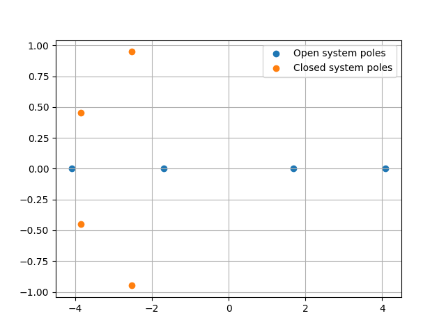
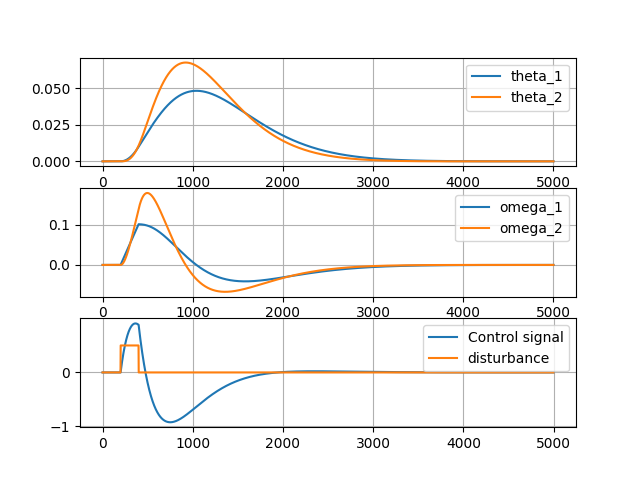
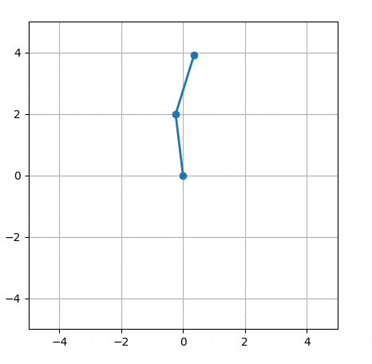
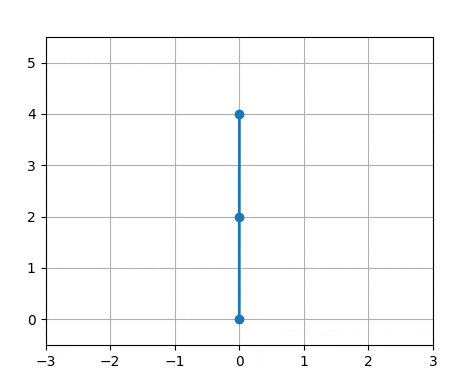

    # Double pendelum

The equations of motion are calculated using Lagrangian mechanics. The
controller is calculated around the linearized point where all rods
are pointing straight up and the angular velocities are zero. The controller is
the optimal LQR controller. The control signal `u` is a torque applied to the
base rod around the origin.

## Equation of motion
\
\
[%7D%20-%20%5Cleft(2%20%5Comega_%7B1%7D%5E%7B2%7D%20%5Csin%7B%5Cleft(%5Ctheta_%7B1%7D%20-%20%5Ctheta_%7B2%7D%20%5Cright)%7D%20%2B%2019.64%20%5Csin%7B%5Cleft(%5Ctheta_%7B2%7D%20%5Cright)%7D%5Cright)%20%5Ccos%7B%5Cleft(%5Ctheta_%7B1%7D%20-%20%5Ctheta_%7B2%7D%20%5Cright)%7D%20%2B%2019.64%20%5Csin%7B%5Cleft(%5Ctheta_%7B1%7D%20%5Cright)%7D%7D%7B2%20%5Cleft(2%20-%20%5Ccos%5E%7B2%7D%7B%5Cleft(%5Ctheta_%7B1%7D%20-%20%5Ctheta_%7B2%7D%20%5Cright)%7D%5Cright)%7D%20%5C%5C%20%20%5C%5C%20)](#_)
[%7D%20%2B%20%5Comega_%7B2%7D%5E%7B2%7D%20%5Csin%7B%5Cleft(2%20%5Ctheta_%7B1%7D%20-%202%20%5Ctheta_%7B2%7D%20%5Cright)%7D%20%2B%2014.73%20%5Csin%7B%5Cleft(%5Ctheta_%7B2%7D%20%5Cright)%7D%20-%204.91%20%5Csin%7B%5Cleft(2%20%5Ctheta_%7B1%7D%20-%20%5Ctheta_%7B2%7D%20%5Cright)%7D%7D%7B2%20%5Cleft(2%20-%20%5Ccos%5E%7B2%7D%7B%5Cleft(%5Ctheta_%7B1%7D%20-%20%5Ctheta_%7B2%7D%20%5Cright)%7D%5Cright)%7D%20%5C%5C%20)](#_)

 \
The poles for the open loop system and closed loop system.

 \
Responce of the system with controller.

 \
Double pendelum without controller.

 \
Pendelum with controller.
